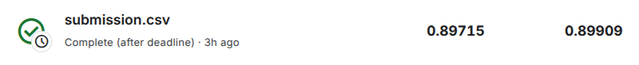

# Santander Customer Transaction Prediction

**Соревнование:** [Santander Customer Transaction Prediction](https://www.kaggle.com/competitions/santander-customer-transaction-prediction)  
**Задача:** Бинарная классификация: предсказание, совершит ли клиент транзакцию.  
**Метрика:** ROC-AUC

---

## Результат

| Public Score | Private Score | Место |
|--------------|---------------|-------|
| **0.89917**  | **0.89700**   | **4595 / 8752** |

**Примечание:** Места с 323 по 5138 занимают участники со скорами от 0.90176 до 0.89800 - разница минимальна (< 0.004). Таким образом, результат находится в основной и плотной группе участников с маленькой разницей в метриках. Участники выше 322 использовали дата-лик.

---

## Подход к решению задачи

### 1. Baselines

#### 1.1 Gaussian Naive Bayes (GNB)

В качестве первого baseline была выбрана модель **Gaussian Naive Bayes (GNB)**, так как все 200 признаков вещественные, имеют распределения, хорошо аппроксимируемые Гауссом, и обладают очень низкой попарной корреляцией.  
GNB показала высокие результаты при минимальном переобучении, не требует настройки гиперпараметров и обучается практически мгновенно.

| Модель | ROC-AUC (val) | PR-AUC (val) | ROC-AUC (train) | PR-AUC (train) |
|--------|---------------|--------------|-----------------|----------------|
| **GaussianNaiveBayes** | 0.8884 ± 0.0033 | 0.5837 ± 0.0060 | 0.8902 ± 0.0007 | 0.5889 ± 0.0015 |

#### 1.2 LGBM (default)

Второй baseline -  **LGBM** с гиперпараметрами по умолчанию. Модель показала качество, сопоставимое с GNB, однако продемонстрировала значительно большее переобучение.

| Модель | ROC-AUC (val) | PR-AUC (val) | ROC-AUC (train) | PR-AUC (train) |
|--------|---------------|--------------|-----------------|----------------|
| **LGBM (default)** | 0.8882 ± 0.0029 | 0.5789 ± 0.0031 | 0.9856 ± 0.0038 | 0.9273 ± 0.0179 |

---

### 2. Подбор гиперпараметров с optuna

Оптимизация гиперпараметров с помощью **Optuna** позволила улучшить результат до:

| Модель | ROC-AUC (val) | PR-AUC (val) | ROC-AUC (train) | PR-AUC (train) |
|--------|---------------|--------------|-----------------|----------------|
| **LGBM (Optuna) = Baseline** | **0.8983 ± 0.0021** | **0.6108 ± 0.0049** | **0.9328 ± 0.0007** | **0.7235 ± 0.0023** |

Ключевые параметры: `learning_rate=0.028`, `reg_lambda=0.00024`, `max_depth=7`, `min_data_in_leaf=320`.
---

### 3. Feature Engineering

Для baseline модели были добавлены следующие признаки, все они **не дали прироста к качеству** при оценке на CV:

| Признаки | ROC-AUC (val) | PR-AUC (val) |
|----------|---------------|--------------|
| Baseline + row-wise статистики | 0.8977 ± 0.0027 | 0.6094 ± 0.0049 |
| Baseline + frequency features (round 4) | 0.8981 ± 0.0025 | 0.6110 ± 0.0046 |
| Baseline + frequency features (round 3) | 0.8978 ± 0.0022 | 0.6101 ± 0.0040 |
| Baseline + frequency features (round 2) | 0.8975 ± 0.0026 | 0.6094 ± 0.0039 |
| Baseline + unique values features | 0.8972 ± 0.0023 | 0.6091 ± 0.0045 |
| Baseline + discretization (uniform) | 0.8978 ± 0.0024 | 0.6090 ± 0.0046 |
| Baseline + discretization (quantile) | 0.8974 ± 0.0026 | 0.6092 ± 0.0039 |

**Описание добавленных признаков:**
1. *row-wise statistics* - агрегационные статистики для конкретного объекта.
2. *frequency statistics* - предположение о возможности выделить признаки в хвостах распределений/поиск категориальных признаков.
3. *unique values features* - идея из топовых ноутбуков.
4. *feature binarizing* - предположение о возможности выделить признаки в хвостах распределений.

---

### 4. Feature Selection

Для **LGBM with best hyperparams** был проведён отбор признаков по встроенным `feature_importances_` (type=`split`) с последовательным включением наиболее важных признаков в итоговый набор **без подбора гиперпараметров** для каждого набора.  
Оптимальным оказался **полный набор** признаков. Однако разница с набором из 150 признаков находится в пределах стандартного отклонения - можно было бы убрать 40–60 наименее важных признаков без потери качества. В итоговой модели они были оставлены.

---

### 5. Что НЕ сработало

| Эксперимент | Результат | Причина |
|-------------|-----------|---------|
| **RandomForest (без регуляризации)** | ROC-AUC val = 0.8432, train = 1.000 | Катастрофическое переобучение на всех 5 фолдах. При `max_depth=5` ROC-AUC val ≈ 0.78 (разница с трейном 0.06). RF делает сплиты на подмножестве из ~14 признаков, каждый из которых несёт слабый сигнал -> важные комбинации пропускаются. |
| **Blending (GNB + LGBM Optuna)** | ROC-AUC val = 0.8971 | Сильная корреляция предсказаний (`corr ≈ 0.9432`) -> блендинг не даёт прироста. |
| **Все добавленные фичи** | Не дали прироста > std | Предположения о полезности агрегаций, частотных статистик, уникальности и бинаризации не подтвердились на честной CV. |

---

### 6. Финальное решение

Финальный сабмит получен **усреднением предсказаний 5 моделей**, обученных на фолдах кросс-валидации.  
Это дало **Public Score = 0.89909** и **Private Score = 0.89715**.

Аналогичная модель, обученная на всём трейне без CV, показала чуть ниже (`0.89566` / `0.89770`), что объясняется исходным подбором гиперпараметров на той же CV.

---

## Анализ топ-решений

Порог `ROC-AUC > 0.901` преодолели лишь 322 участника из 8752.  
Ключевой фактор - использование **"магии" датасета**, основанной на его синтетической природе:

1. В тестовой выборке есть **фейковые (синтетические)** объекты (отличаются числом уникальных значений в признаках для каждого объекта).
2. В тесте есть две части: с распределением как в трейне и с другим.
3. На основе этого можно выделить Public / Private LB.

На основе этого победителями была разработана методика:
- Выделение **реальных и фейковых объектов** в тесте.
- Подсчёт **частотных статистик** и **флагов уникальности** по train + real test.
- Использование этой информации в ансамблях (например, [топ-1 решение](https://www.kaggle.com/competitions/santander-customer-transaction-prediction/writeups/wizardry-1-solution): NN + LGBM).

**Замечение:** Эти подходы используют **дата-лик** (статистики, посчитанные на тесте). В рамках учебной задачи это некорректно, поэтому сравнение с топ-решениями не проводилось.

---

## Интересные подходы других участников

1. [**Modified Naive Bayes**](https://www.kaggle.com/code/cdeotte/modified-naive-bayes-santander-0-899) — модификация GNB, дающая результат на уровне LGBM.
2. [**200 fast models**](https://www.kaggle.com/code/titericz/giba-single-model-public-0-9245-private-0-9234) — обучение 200 отдельных LGBM на каждом признаке с последующей агрегацией. Сильно ускоряет вычисления без потери в качестве.

---

## Воспроизведение результата
Для воспроизведение результата достаточно запустить 1, 3 ячейки ноутбука (imports and load data), ячейку с определением `simple_averaging_blending_with_lgbm` в п.6 и ячейку самого создания submit'a в п.7.